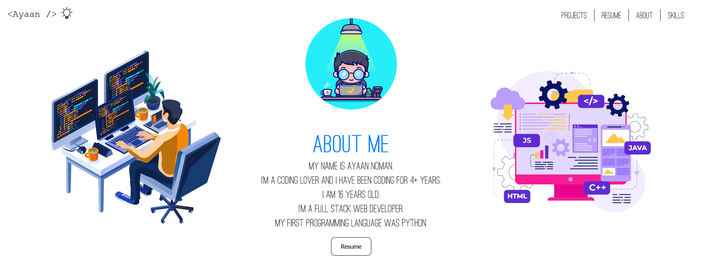

<h2 align="center">
  Portfolio Website 
</h2>
 

## TL;DR

You can fork this repo to modify and make changes of your own. Please give me proper credit. Thanks!

## This Project was Built in less than 1 Week!

## Built With

Portfolio Website with Beautiful Design made by Me with Dark Theme Option as well and Great Animations and all Devices Resolution Supported as well using Bootstrap Grid System.  Would Highly Recommend Viewing the Website yourself instead of Screenshots!!! 

This project was built using these technologies.

- React.js
- CSS / SCSS
- BootStrap
- JS/JSX
- VsCode

## Features
  👾 Optimized for all Devices

**📖 Beautiful Clean Design**

**🎨 Styled with React-Bootstrap and Css/SCSS**

**📱 Fully Responsive**

## Getting Started

Clone down this repository. You will need `node.js` and `git` installed globally on your machine.

## 🛠 Installation and Setup Instructions

1. Installation: `npm install`

2. In the project directory, you can run: `npm start`

Runs the app in the development mode.\
Open [http://localhost:3000](http://localhost:3000) to view it in the browser.
The page will reload if you make edits.

## Usage Instructions

Open the project folder and Navigate to `/src/components/`.  
You will find all the components used and you can edit your information accordingly.

### Show your support

Give a ⭐ if you like this website!
